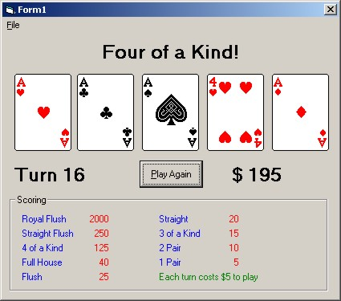



## Video Poker

### Description

Simple video poker game, demonstrates the use of cards.dll. Detects various types of hands (full house, 4 of a kind, etc) and pays appropriate amount. Written on win2000. Not tested on other platforms.
 
### More Info
 
'requires cards.dll (installed with built-in Win games).

             |
---                |---
**Submitted On**   |2001-07-13 11:00:12
**By**             |[Gregory Mahan](https://github.com/Planet-Source-Code/PSCIndex/blob/master/ByAuthor/gregory-mahan.md)
**Level**          |Intermediate
**User Rating**    |4.3 (13 globes from 3 users)
**Compatibility**  |VB 6\.0
**Category**       |[Games](https://github.com/Planet-Source-Code/PSCIndex/blob/master/ByCategory/games__1-38.md)
**World**          |[Visual Basic](https://github.com/Planet-Source-Code/PSCIndex/blob/master/ByWorld/visual-basic.md)
**Archive File**   |[Video Poke231517202001\.zip](https://github.com/Planet-Source-Code/gregory-mahan-video-poker__1-25251/archive/master.zip)

